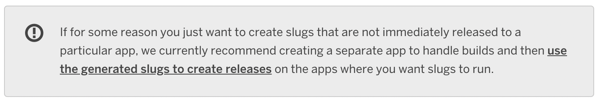

# slugcmplr



```bash
go get github.com/cga1123/slugcmplr
```

`slugcmplr` is a CLI tool that interfaces with the Heroku Platform API in order
to enable you and your team to detach the building of your Heroku application
from the releasing of it.

This enables your CI/CD pipeline to run tests and building of your application
in parallel, potentially reducing the merge to deploy time for your team!

There are two commands available, `build` and `release` each require a
`[target]` argument (the name or identifier for your production application)
and a `--compiler` flag (the name or identifier for a 'compile' application)

The `build` command will synchronise all buildpacks and environment variables
between your production and compile application, it also sets the compile app
into maintenance mode and escapes any `release` task you have in your
`Procfile` (if present).

This ensures that your compile application is not exposed publicly and does not
run any release task (such as any DB migrations) during the compilation phase.

The `release` task performs a 'slug promotion' (a slug is the name Heroku gives
the artifact of a build) which transfers your application from your compile app
to your production app and triggers a normal Heroku release phase.


## Authentication

The `slugcmplr` CLI looks for credentials to `api.heroku.com` in your `.netrc`
file, this is the same technique used by [`heroku/cli`] and so if you are
currently making use of the `heroku` command during CI, you should already be
logging in somehow and have no issues.

Otherwise populating your `.netrc` should be a case of adding something
equivalent to the following script (assuming the `HEROKU_EMAIL` and
`HEROKU_API_KEY` are correctly populated environment variables):

```bash
cat << EOF >> ${HOME}/.netrc
machine api.heroku.com
  login ${HEROKU_EMAIL}
  password ${HEROKU_API_KEY}
EOF
```

---

For more background on this you might find [this] Medium article helpful.

[this]: https://medium.com/carwow-product-engineering/speeding-up-our-heroku-deploys-by-35-percent-f9fa6f6cf404
[`heroku/cli`]: https://github.com/heroku/cli
